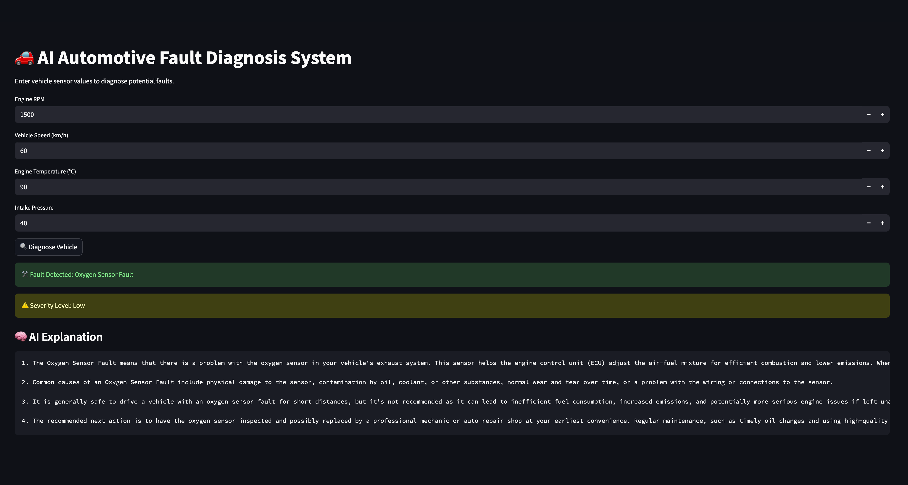

# 🚗 AI Automotive Fault Diagnosis & Explainable AI System


An end-to-end **automotive fault diagnosis platform** that combines **machine learning**, **rule-based engineering logic**, and **large language model (LLM)–powered explainability**, built with a **production-style architecture** and fully **Dockerized deployment**.

This project focuses on **system design, explainability, and deployment practices** rather than only model accuracy—reflecting real-world automotive software engineering requirements.

---

## 📌 Project Motivation

Modern vehicles generate large volumes of sensor data and diagnostic signals, yet interpreting these signals often requires expert knowledge. Raw fault codes and sensor values are difficult for non-experts to understand and provide limited actionable insight.

This project explores how:
- **Machine Learning** can assist in fault prediction  
- **Rule-based logic** can ensure deterministic and safety-aligned decisions  
- **Explainable AI (LLMs)** can translate technical outputs into human-understandable diagnostics  

The system is designed with **automotive software principles**, emphasizing **clarity, modularity, and reproducibility**.

---

## 🧠 System Overview

The system processes vehicle sensor inputs and produces:
- A predicted fault type
- A fault severity classification
- A detailed, natural-language explanation suitable for humans

### High-Level Flow

- Vehicle Sensor Data
        
- Machine Learning Model
        
- Fault Prediction
        
- Rule-Based Severity Classification
        
- Explainable AI (LLM)
        
- FastAPI Backend
        
- Streamlit User Interface

---

## 🏗️ Architecture & Design Philosophy

### Key Design Decisions

- **Separation of concerns**  
  - ML prediction
  - Severity logic
  - Explainability
  - API layer
  - UI layer

- **Explainability-first approach**  
  The system is designed so predictions are not treated as black-box outputs.

- **Deterministic safety logic**  
  Severity classification is rule-based rather than probabilistic, aligning with automotive safety expectations.

- **LLM as an external service**  
  The large language model runs outside the Docker containers, keeping services lightweight and reflecting real production architectures.

---

## 🤖 Explainable AI Layer (LLM Integration)

The explainability component uses a **locally hosted large language model (Mistral via Ollama)**.

- The backend sends a structured diagnostic prompt to the LLM
- The LLM generates human-readable explanations covering:
  - Fault meaning
  - Common causes
  - Safety considerations
  - Recommended next actions

### Why External LLM?

- Avoids embedding large models inside containers
- Improves modularity and scalability
- Preserves data privacy
- Mirrors real-world AI service architectures

---

## 🧪 Machine Learning Approach

- **Problem Type:** Supervised multi-class classification  
- **Model:** Random Forest Classifier  
- **Features:** Engine and vehicle sensor values  
- **Target:** Automotive fault category  

The ML model is intentionally kept simple and interpretable to emphasize:
- Correct pipeline design
- Feature handling
- Deployment readiness

---

## ⚙️ Technology Stack

**Core Technologies**
- Python 3.10
- Scikit-learn
- NumPy & Pandas

**Backend**
- FastAPI
- Pydantic

**Frontend**
- Streamlit

**Explainable AI**
- Ollama (local LLM runtime)
- Mistral (LLM)

**Deployment**
- Docker
- Docker Compose

---

## 🚀 Features

| Feature | Description |
| :--- | :--- |
| ML Inference | Predicts vehicle faults using sensor data |
| Severity Logic | Rule-based classification of severity |
| Explainability | Natural-language explanations via LLM |
| Deployment | Dockerized microservices |
| UI | Interactive Streamlit dashboard |

---

## 📊 Results

### 🚗 ML Prediction
The system predicts automotive fault categories from structured sensor data.

### ⚠️ Severity Classification
Deterministic rule-based logic assigns severity levels (Low/Medium/High).

### ✍️ Explainable AI Output
Detailed natural-language explanations are generated using a locally hosted LLM (Mistral via Ollama).

### 🧪 Validation
The pipeline flow has been validated end-to-end through Dockerized deployment and UI interaction.

---

## ▶️ How to Run (Docker)

### Prerequisites
- Docker & Docker Compose
- Ollama installed on host machine
- Mistral model pulled via Ollama

```bash
ollama pull mistral
```
### Run the system
```bash
docker compose up --build
```
### Access
- #### Streamlit UI: http://localhost:8501
- #### API Docs (Swagger): http://localhost:8000/docs

### Testing

Run:
```bash
pytest
```
---

## 📁 Project Structure
```
ai-automotive-fault-diagnosis/
├── src/
│   ├── api/          # FastAPI backend
│   ├── ml/           # ML training & inference
│   ├── llm/          # Explainable AI logic
│   └── utils/        # Helper modules
├── ui/               # Streamlit frontend
├── models/           # Saved models
├── data/             # Processed & sample data
├── docs/             # Screenshots & diagrams
├── Dockerfile
├── docker-compose.yml
├── requirements.txt
└── README.md
```

---

## 🔮 Future Improvements

- Integration with real-world OBD-II datasets
- Advanced hybrid ML + rule-based severity scoring
- Cloud deployment (AWS / GCP)
- Continuous monitoring and logging
- Multi-language explanations for global users

---

## 🧩 Key Takeaways

This project demonstrates:
- End-to-end ML system design
- Explainable AI integration
- Production-style backend and frontend architecture
- Containerized deployment practices
- Automotive software engineering mindset
